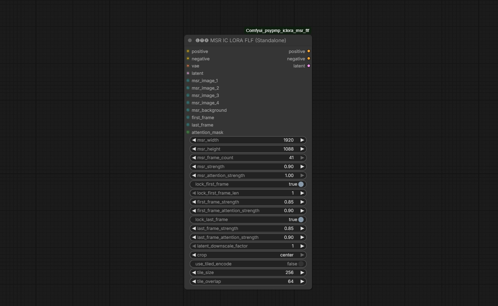

# 🅛🅣🅧 MSR IC-LoRA FLF (Standalone)

**Версия:** 0.9.4

## 📝 Что нового (Changelog)
* **v0.9.4:** Исправлен краш с ошибкой `ValueError: guide pre_filter_counts != keyframe grid mask length`. Теперь нода корректно добавляет координаты `keyframe_idxs` для MSR-видео в кондишен (conditioning). Реализован "dual-chain" метод (двойная цепочка), при котором MSR-видео используется только для cross-attention (внимания), а индивидуальные картинки MSR инжектятся напрямую в латент.
* **Благодарность:** Метод с двойной цепочкой (dual-chain) взят из [этого видео](https://www.youtube.com/watch?v=uirABckAK4o&).

Высокооптимизированная монолитная нода для ComfyUI, объединяющая **Multi-Subject Reference (MSR)**, **First Frame (FL)** и **Last Frame (LF)** в один производительный модуль для LTX-Video.

Объединяя эти три функции, нода навсегда решает критические баги смещения индексов на таймлайне, предотвращает падение памяти (`IndexError`) и обеспечивает абсолютное физическое удержание пикселей исходного кадра через механизм жесткой блокировки маски шума (Inplace-блокировка).

---

## 📖 Языки
* [English Version (Английская версия)](README.md)

---

## 🛠️ Какие проблемы решает эта нода

### 1. Конфликт нескольких нод на таймлайне (Смещение Индексов)
* **Проблема:** При последовательном подключении трех отдельных нод `IC-LoRA Guide` (для MSR, First Frame и Last Frame) в цепочку в ComfyUI, первые ноды (например, MSR) внедряют референсные токены в кондишен, искусственно увеличивая его длину. Последующие ноды (например, Last Frame) пытаются рассчитать свою позицию на основе этой раздутой длины, из-за чего финальный кадр применяется слишком рано (например, на 12-й секунде вместо 18-й).
* **Сбой:** Попытка вручную указать правильный индекс кадра в интерфейсе часто нарушает внутренние проверки ComfyUI, вызывая ошибку `IndexError: list index out of range` в потоке `prompt_worker` и намертво обрушивая стек памяти моделей.
* **Решение:** Наша нода выполняет **изолированный подсчет длины таймлайна** строго *до* внедрения токенов. Мы полностью обходим сломанную логику автоматического расчета индексов и используем прямую математическую инжекцию:
  $$\text{latent\_idx} = \text{original\_latent\_length} - \text{guide\_length}$$
  Это гарантирует, что Last Frame зафиксируется точно в финальной точке видео, исключая наложение кадров, баги раннего завершения и сбои памяти.

### 2. Проблема «плавающего» (деформирующегося) кадра
* **Проблема:** Стандартная IC-LoRA работает как мягкий ориентир (магнит), а не физический замок. Из-за этого первый и последний кадры могут «плыть», деформироваться, терять детали или лица в процессе сэмплинга, так как модель пытается сгладить анимацию.
* **Решение:** Мы внедрили жесткое **Inplace-запирание латентов** (`lock_first_frame` и `lock_last_frame`). При включении этой опции нода перехватывает маску шума для выбранных кадров и принудительно обнуляет её:
  ```python
  noise_mask[:, :, 0, :, :] = 0.0  # Физическая заморозка латентного шага
  ```
  Это физически блокирует пиксели первого и последнего кадров от изменений сэмплером, пока перекрестное внимание IC-LoRA плавно и бесшовно растягивает генерацию на оставшийся таймлайн.

---

## 🌟 Ключевые возможности

* **Монолитная архитектура:** Объединяет MSR, первый и последний кадры в одну ноду. Никакой лапши из проводов на вашем холсте.
* **Умный сборщик MSR-последовательностей:** Принимает до 4 изображений объекта + 1 фоновое изображение. Автоматически масштабирует, дублирует и равномерно распределяет их в MSR-сетку (например, 17, 25, 33, 41 кадр) для точного удержания лица/стиля.
* **Жесткое Inplace-запирание:** Обнуление масок шума на первом/последнем кадрах гарантирует 100% идентичность исходных и сгенерированных пикселей на границах видео.
* **Плиточное (Tiled) VAE кодирование:** Встроенная поддержка плиточного кодирования (`tile_size`, `tile_overlap`) предотвращает вылет GPU по нехватке памяти (OOM) при обработке тяжелых референсов (например, 1280x736 и выше).
* **Маскирование внимания:** Возможность подключения черно-белой `attention_mask` для изоляции влияния внимания IC-LoRA исключительно на объекте, исключая искажение фона.
* **Масштабирование латентов:** Поддержка коэффициента даунскейла латентов (`latent_downscale_factor` 1.0 или 2.0) для совместимости со сжатыми моделями IC-LoRA.

---

## 📐 Параметры ноды и входы



| Название параметра | Тип | По умолчанию | Описание |
| :--- | :---: | :---: | :--- |
| **positive** | CONDITIONING | *Обязательно* | Положительный промпт, к которому будут добавлены токены внимания референсов. |
| **negative** | CONDITIONING | *Обязательно* | Отрицательный промпт. |
| **vae** | VAE | *Обязательно* | Модель VAE для кодирования изображений. |
| **latent** | LATENT | *Обязательно* | Основной латентный контейнер (задает разрешение и длину видео). |
| **msr_width / msr_height** | INT | `1920 / 1088` | Разрешение, до которого будут сжаты все MSR-кадры перед кодированием VAE. |
| **msr_frame_count** | COMBO | `41` | Количество кадров в сетке MSR (17, 25, 33, 41). Больше = стабильнее лицо, но больше VRAM. |
| **msr_image_1 - 4** | IMAGE | *Опционально* | Изображения вашего персонажа/объекта с разных ракурсов. |
| **msr_background** | IMAGE | *Опционально* | Референс фона (встраивается в конец MSR-последовательности). |
| **msr_strength** | FLOAT | `0.90` | Сила прямой инжекции MSR-латентов в пространство генерации. |
| **msr_attention_strength**| FLOAT | `1.0` | Сила влияния перекрестного внимания MSR-последовательности. |
| **first_frame** | IMAGE | *Опционально* | Изображение для самого первого кадра видео. |
| **lock_first_frame** | BOOLEAN | `True` | Включает жесткую Inplace-заморозку пикселей первого кадра. |
| **lock_first_frame_len** | INT | `1` | Количество замороженных латентных кадров (устраняет размытие от интерполяции VAE). |
| **first_frame_strength** | FLOAT | `0.85` | Сила прямой инжекции латентов первого кадра. |
| **first_frame_attn_strength**| FLOAT | `0.90` | Сила влияния перекрестного внимания первого кадра. |
| **last_frame** | IMAGE | *Опционально* | Изображение для самого последнего кадра видео. |
| **lock_last_frame** | BOOLEAN | `True` | Включает жесткую Inplace-заморозку пикселей последнего кадра. |
| **last_frame_strength** | FLOAT | `0.85` | Сила прямой инжекции латентов последнего кадра. |
| **last_frame_attn_strength**| FLOAT | `0.90` | Сила влияния перекрестного внимания последнего кадра. |
| **latent_downscale_factor**| FLOAT | `1.0` | Коэффициент сжатия латентов (например, 2.0 для сжатых моделей IC-LoRA). |
| **crop** | COMBO | `center` | Метод изменения размера (`disabled` растягивает, `center` обрезает пропорционально). |
| **use_tiled_encode** | BOOLEAN | `False` | Включает плиточное кодирование VAE для защиты от вылетов по памяти (OOM). |
| **attention_mask** | MASK | *Опционально* | Маска для ограничения внимания IC-LoRA выбранной областью. |

---

## 🚀 Установка

1. Перейдите в папку кастомных нод вашего ComfyUI:
   ```bash
   cd ComfyUI/custom_nodes/
   ```
2. Склонируйте этот репозиторий:
   ```bash
   git clone https://github.com/your-username/Comfyui_psypmp_iclora_msr_flf.git
   ```
---

## 🤝 Благодарности

Эта нода разработана на базе и объединяет выдающиеся решения проектов:
* **Lightricks / ComfyUI-LTXVideo** за оригинальную систему внимания IC-LoRA.
* **Licon-MSR** за метод автоматического формирования последовательностей Multi-Subject Reference.
